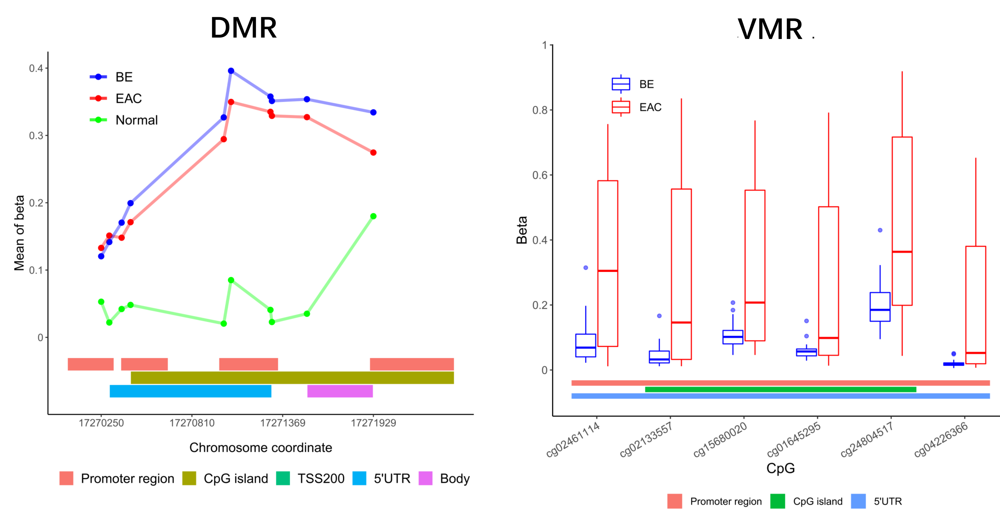
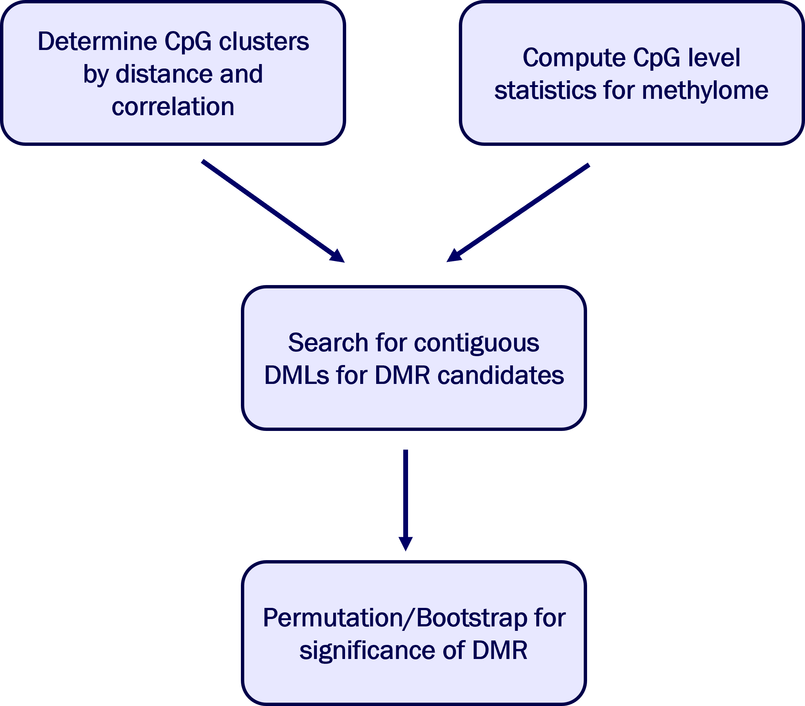

## DMseg: detecting differential methylation regions (DMRs) and variably methylated regions (VMR) in methylome 

This is a Python package to search through methylome-side CpGs sites for DMRs between two biological conditions. 
The following figure shows examples of DMR and VMR applying on the comparisons among Barrett's esophagus (BE), esophageal adenocarcinoma (EAC), and normal samples  


---
The algorithm executes the following analysis steps:



1.  A linear regression model is fitted to the beta values for each CpG, using the user-input covariates: the first variable is the group label of interest.
2.  Nominal p-values from individual CpG associations are used to define the DMR: more than or equal to two consecutive CpGs with p-value <0.05 will be considered as candidate DMR. A likelihood ratio statistic (LRT) is computed for a candidate DMR.
3.  Group labels will be permuted for `B` times, step `1` and `2` are repeated for each permuation dataset. Family-wise error rate is computed using the null distribution of LRT based on permutation. 

---

To install the package (please try one of the following): 

* Installing locally using (you need to git clone it to local first)
`
python3 -m pip install .
`

* Installing from github
`python3 -m pip install -e git+https://github.com/xwang234/DMseg.git#egg=DMseg
`

---

The package calls a "pipeline" function to detect DMR/VMR, description of its inputs/output are as follows:

```
pipeline(betafile, colDatafile, positionfile, maxgap=500, sd_cutoff=0.025, diff_cutoff=0.05, zscore_cutoff=1.96, zscore_cutoff1=1.78, B=500, B1=4500, seed=1001, task='DMR', stratify=True, Ls=(0, 10, 20), mergecluster=True, merge_cutoff=0.6, ncore=4)
```

    Parameters
    ----------
    betafile : string
        path of csv file for the beta data
    colDatafile : string
        path of covariates file, first column is for sample names, second column is for the group variable to compare
    positionfile : string
        path of CpGs position info file, first column is for CpG name, second column for chromosome, third column for position
    maxgap : int
        The distance cutoff to define a cluster of contiguous CpGs, default is 500BP
    sd_cutoff : float
        standard deviation cutoff of beta values. A ROI cluster should have at least one CpG with greater deviation, default is 0.025
    diff_cutoff : float
        cutoff based mean diff between groups. A ROI cluster should have at least two CpG with coef greater than the cutoff, default is 0.05
    zscore_cutoff : float
        cutoff based on z-score. A ROI cluster should have at least two strong CpGs with zscore greater than the cutoff, default is 1.96
    zscore_cutoff1 : float
        second cutoff based on zscore, to select a weak CpG if the CpG is in the middle of two strong CpGs, default is 1.78
    B : int
        The number of permutation for all CpGs, default is 500
    B1 : int
        The number of added permutation for long clusters, default is 4500
    seed : int
        random seed number for permutation process
    task : string
        if task is "DMR" then the function call DMR, otherwize call VMR
    stratify : bool
        if TRUE, stratify clusters based on width
    Ls : tuple
        it is used to stratify clusters based on their widths. 
        in default Ls=(0,10,20) which means we will compute p-values for 1) short clusters with width <=10,
        and 2) short clusters with width in (10,20], and 3) long clusters with width>20 separately.
    mergecluster : bool
        if TRUE, merge two nearby clusters if they have high correlation between edge CpGs
    merge_cutoff : float
        cutoff of correlation between edge CpGs of two nearby clusters, used to merge clusters, default is 0.6
    ncore : int
        number of CPU used for computation. ncore=1: not to use parallel computing
    Returns
    -------
    dataframe
        Each row respresents a detected peak/segment, with position info, seg_mean, LRT, p-value and FWER
 
---

To run an example data in Python

```
import pkg_resources
from DMseg.dmseg import *
betafile = pkg_resources.resource_filename('DMseg', 'data/example_beta.csv')
colDatafile = pkg_resources.resource_filename('DMseg', 'data/example_colData.csv')
positionfile = pkg_resources.resource_filename('DMseg', 'data/example_position.csv')
# To detect DMR
DMR_res = pipeline(betafile, colDatafile, positionfile)
print(DMR_res.loc[DMR_res.FWER<0.05])
# The following result shows detected DMR regions with FWER less than 0.05:
  cluster  cluster_L    chr   start_cpg  start_pos     end_cpg  end_pos  n_cpgs seg_mean         LRT         P   FWER
0     145         10  chr10  cg05585149     695844  cg22656048   696356       9    0.129   78.452856  0.000012  0.002
1     323          7  chr10  cg13771471    1505595  cg01446627  1508061       7    -0.19  105.524264  0.000012  0.002
2     367          8  chr10  cg04724406    1712918  cg23631669  1713418       6    -0.15   69.025041  0.000035  0.004
3      87         20  chr10  cg16977735     530714  cg08605347   533359      18   -0.092  128.186842  0.000166  0.024
4     154          8  chr10  cg12808565     729259  cg18503829   729956       6   -0.133   54.479745  0.000201  0.028
5     132          7  chr10  cg25354348     670562  cg17293868   671007       4   -0.143   51.040964  0.000260  0.034
# To detect VMR
VMR_res = pipeline(betafile, colDatafile, positionfile, task="VMR")
print(VMR_res.loc[VMR_res.FWER<0.05])
# Detected VMR with FWER less than 0.05:
   cluster  cluster_L    chr   start_cpg  start_pos     end_cpg  end_pos  n_cpgs seg_mean        LRT         P   FWER
0      145         10  chr10  cg05585149     695844  cg22656048   696356       9    -0.73  81.115778  0.000000  0.000
1      323          7  chr10  cg13771471    1505595  cg01446627  1508061       7   -0.712  71.251733  0.000012  0.002

```


